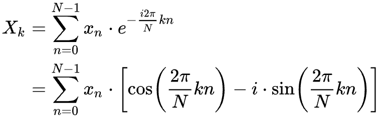

# Pianolizer

## Description

A simple and efficient algorithm for spectral analysis of music.
Examples for browser and Raspberry Pi are provided.

[](https://youtu.be/UVvdstcv4IY "See the music with Pianolizer")

## tl;dr

- [Pianolizer app](https://sysd.org/pianolizer/) - runs directly in the browser. Also, mobile browser. Chrome is recommended for the best experience.
- [Algorithm benchmark](https://sysd.org/pianolizer/benchmark.html) - test the speed of the core algorithm, in the browser. WASM results closely match what is expected from the native binary performance, on the same machine. 44100 samples per second is enough for realtime performance. As a matter of fact, one can get decent results with as little as 8000 samples per second (saving both CPU & RAM resources!); however the resampling algorithm implementation is left as an exercise to the reader (that is, for the JS/browser; the `pianolizer` CLI utility is meant to be paired with [sox](http://sox.sourceforge.net)).

## Building the hardware

### Parts list

0. Any [Raspberry Pi](https://rpilocator.com/) or a compatible device.
0. [ReSpeaker 2-Mics Pi hat by Seeed](https://www.seeedstudio.com/ReSpeaker-2-Mics-Pi-HAT.html). Any ALSA-compatible audio input device should work (also the external USB ones), but YMMV.
0. WS2812B RGB LED strip, 1m-long with 144 LEDs/m. I used [this specific one](https://www.amazon.de/-/en/gp/product/B08DJCBTS3/ref=ppx_yo_dt_b_asin_title_o00_s00?th=1).
0. A cable with a connector compatible with [this one](https://www.seeedstudio.com/Grove-4-pin-Male-Jumper-to-Grove-4-pin-Conversion-Cable-5-PCs-per-Pack.html), for connecting the LED strip to the ReSpeaker device.
0. An SD card with at least 4GB capacity.
0. A power source for the Raspberry Pi.

### Assembly instructions

0. Connect the ReSpeaker hat to the Raspberry Pi.
0. Connect the LED strip to the **GP12** port of the ReSpeaker hat. Connect _GND_ of the strip to _pin 4_; _+5V_ to _pin 3_ & _DATA_ to _pin 1_ (this standard is called [Grove System](https://wiki.seeedstudio.com/Grove_System/)).
0. Download & extract the [pianolizer-2022-11-13.img](https://sysd.org/pianolizer/pianolizer-2022-11-13.img.xz) image file (it is based on [2022-09-22-raspios-bullseye-arm64-lite.img](https://downloads.raspberrypi.org/raspios_lite_arm64/images/raspios_lite_arm64-2022-09-26/2022-09-22-raspios-bullseye-arm64-lite.img.xz), BTW).
0. Write the image to the SD card. I recommend the [Raspberry Pi Imager](https://www.raspberrypi.com/software/), since it works with any OS and has a GUI to conveniently setup WiFi/SSH *before* booting.
0. Customize the [pianolizer.txt](https://github.com/creaktive/pianolizer/blob/master/misc/pianolizer.txt) file on the initialized SD card (or leave it as-is when using the same parts as listed above).
0. Power up! After the boot completes, the LEDs start blinking when you talk to the microphone :)

## Building the software

The [C++ implementation](cpp/pianolizer.hpp) should compile just fine on any platform that supports C++14, there are no dependencies as the code uses C++14 standard data types.
It is known to compile & run successfully with [Clang](https://clang.llvm.org), [GCC](https://gcc.gnu.org) and [Emscripten](https://emscripten.org).
The target platform should support `double float` operations efficiently (in other words, hardware FPU is rather mandatory).

Compile the [native binary](cpp/main.cpp) (AKA the `pianolizer` CLI utility) _and_ to [WebAssembly](https://webassembly.org/):

```
make
```

Compile only the [native binary](cpp/main.cpp):

```
make pianolizer
```

To compile only to WebAssembly:

```
make emscripten
```

[Test and benchmark](cpp/test.cpp) the [C++ implementation](cpp/pianolizer.hpp) (**optional**; depends on [GoogleTest](https://github.com/google/googletest/)):

```
make test
```

Delete all the compiled files:

```
make clean
```

## Using the CLI utility

### General instructions

```
$ ./pianolizer -h
Usage:
        sox -V -d -traw -r44100 -b32 -c1 -efloat - | ./pianolizer | sudo misc/hex2ws281x.py

Options:
        -h      this
        -b      buffer size; default: 256
        -s      sample rate; default: 44100 (Hz)
        -p      A4 reference frequency; default: 440 (Hz)
        -a      average window (effectively a low-pass filter for the output); default: 0.04 (seconds; 0 to disable)

Description:
Consumes an audio stream (1 channel, 32-bit float PCM)
and emits the volume levels of 61 notes (from C2 to C7) as a hex string.
```

The `pianolizer` CLI utility receives an input stream of following specifications:

```
Channels       : 1
Sample Rate    : 44100
Sample Encoding: 32-bit Floating Point PCM
```

And emits a stream of 122-character hexadecimal strings representing the _volume level_ of the 61 consecutive notes (from C2 to C6):

```
...
000000000000000000010004020100000000000001010419110101010102182e040203192202040b080201010001000105010901060101000000000000
0000000000000000000100040201000000000000010104151301010101021634030202192202040a070101010001000104010801060101000000000000
00000000000000000000000402010000000000000101031215010101010215380302021922020309060101010001000104010701050101000000000000
000000000000000000000004030100000000000000010310160101010103163a0302021a20020308050101010001000104010601040101000000000000
00000000000000000000000404010000000000000001030e1601010102041839030202181f020307050101000001000103010601040101000000000000
...
```

Each level uses 2 hexadecimal characters (therefore, the value range is 0-255).
A new string is emitted every 256 samples (adjustable with `-b` option); that amounts to ~6ms of audio.

[sox](http://sox.sourceforge.net) is recommended to provide the input for `pianolizer`.
When using a microphone source, `sox` will insert tiny delays between the samples, so that the audio stream is synchronized with the sample rate.
When decoding an audio file, `sox` spits out the data as fast as possible.
With that, it should be trivial to convert the `pianolizer` output into a static spectrogram image.

### Raspberry Pi specific

The included [Python script](misc/hex2ws281x.py) consumes the hexadecimal output of `pianolizer` and drives a WS2812B LED strip (depends on the [rpi_ws281x library](https://github.com/rpi-ws281x/rpi-ws281x-python)).
Conveniently, 1m LED strip with _144 diodes/meter_ matches precisely the standard piano keyboard dimensions and is enough to cover 61 keys.

Raspberry Pi has no audio input hardware at the time of writing, therefore an expansion board is required.
I am using [ReSpeaker 2-Mics Pi HAT by Seeed](https://www.seeedstudio.com/ReSpeaker-2-Mics-Pi-HAT.html).

Check [rc.local](misc/rc.local) for an example of how to drive the LED strip with a microphone.
You will probably need to adjust the sample rate and volume in this script, and also the I/O pin number in the [Python script](misc/hex2ws281x.py).

## Using the library

The main purpose of Pianolizer is _music visualization_.
Because of this, the volume level values are squared (more contrast, less CPU usage) and averaged (effectively, a low-pass filter of the output, otherwise it is unpleasant and potentially harmful to look at, due to flickering).
However, the library is modular by design, so you can shuffle things around and implement other stuff like [DTMF decoder](https://en.wikipedia.org/wiki/Dual-tone_multi-frequency_signaling) or even a [vocoder](https://en.wikipedia.org/wiki/Vocoder) (YMMV!).

In a nutshell, first you need to create an instance of `SlidingDFT` class, which takes an instance of `PianoTuning` class as a parameter. `PianoTuning` requires the sample rate parameter. Sample rate should be at least 8kHz.
By default, `PianoTuning` defines 61 keys (from C2 to C7), with A4 tuned to 440Hz.
Why not 88 keys, like most of the acoustic pianos?
Essentially, it is because the frequencies below C2 (65.4Hz) would require some extra processing to be visualized properly.

Once you have an instance of `SlidingDFT`, you can start pumping the audio samples into the `process` method (I recommend doing it in chunks of 128 samples, or more).
`process` then returns an array of 61 values (or whatever you defined instantiating `PianoTuning`) ranging from 0.0 to 1.0, each value being the squared amplitude of the fundamental frequency component for that key.

### C++

Standard: C++14

- Include [pianolizer.hpp](cpp/pianolizer.hpp) in your project. It is reasonably well commented and documented and relevant examples are provided inline.
- [benchmark.cpp](cpp/benchmark.cpp) is a good starting point.
- [test.cpp](cpp/test.cpp) describes the expected behavior of the library.

### JavaScript & WebAssembly

Standard: ECMAScript 6

- Include [pianolizer.js](js/pianolizer.js) in your project. It is reasonably well commented and documented and relevant examples are provided inline.
- [benchmark.js](js/benchmark.js) is a good starting point. It runs directly via [Node.js](https://nodejs.org/) (try `node js/benchmark.js`). Also check [benchmark.html](benchmark.html), which works in the browser.
- [AudioWorkletProcessor](https://developer.mozilla.org/en-US/docs/Web/API/AudioWorkletProcessor) compatibility layer can be found in [pianolizer-worklet.js](js/pianolizer-worklet.js). Worklet is set up in [index.html](index.html).
- [visualization.js](js/visualization.js) is what draws the keyboard and the spectrogram.

## Theory

How/why does this algorithm work?
First of all: it is **not** based on the [Fast Fourier Transform (FFT)](https://en.wikipedia.org/wiki/Fast_Fourier_transform).
FFT is awesome, and is indeed the first option for almost anything spectral analysis related.
In a nutshell, FFT takes _N_ data points of some signal, and twists them into _N_ frequency bands.
Works the best when _N_ is a power of two.
FFT uses a brilliant mathematical shortcut which makes this operation go very efficiently.
And on top of that, nowadays we have [extremely efficient and portable implementations of this algorithm](http://fftw.org).

But... It is not very suitable for recognizing the **musical** pitches.
Here's why: all the frequency bands from the output of FFT have exactly the same _bandwidth_.
On the other hand, our ears and brains evolved in such a way that 65Hz sounds distinctively different from 98Hz; however 4186Hz sounds barely distinguishable from 4219Hz.
Therefore, regardless of our cultural background, _musical sounds_ follow a logarithmic distribution, with the _bandwidth_ of the subsequent notes gradually increasing.

This effectively voids the computational advantage of using FFT for this specific application.
Fortunately, the Fourier transform does not need to be a _fast_ one.
Let's revisit the basics of the **Discrete Fourier Transform** (DFT):



The interpretation most relevant for our purposes would be:

> It is the cross correlation of the input sequence, _xₙ_, and a complex sinusoid at frequency _k / N_. Thus it acts like a matched filter for that frequency.
(source: [Wikipedia](https://en.wikipedia.org/wiki/Discrete_Fourier_transform))

Unpacking the above formula to C++ code (JavaScript has no native complex number type):

```C++
const complex<double> discreteFourierTransform (
  const vector<complex<double> >& x,
  const double k, const unsigned N
) {
  if (x.size() < N)
    throw invalid_argument("x vector should have at least N samples");
  const double q = 2. * M_PI * k / N;
  complex<double> Xk = complex<double>(0., 0.);
  for (unsigned n = 0; n < N; n++)
    Xk += x[n] * complex<double>(cos(q * n), -sin(q * n));
  return Xk;
}
```
(check the [full example](misc/dft.cpp))

A somewhat free interpretation of what's going on here is: the code generates a _template signal_ and checks it's similarity with the _input signal_.
This _template_, when plotted, looks exactly like a corkscrew spiral:


It has the length of _N_ data points.
The pitch of the corkscrew, which determines the frequency of the template signal, is derived from the _k / N_ ratio.
More specifically, this is the relationship between _k_, _N_, _frequency_, _bandwidth_ and the _sample rate_:

```C++
// in Hertz
const double sampleRate = 44100;
const double frequency = 441;
const double bandwidth = 21;

const double k = frequency / bandwidth;
const double N = sampleRate / bandwidth;

assert(k == 21);
assert(N == 2100);
```

With this, we can establish that what we need is to find such pairs of _k_ and _N_ that closely match the frequencies and the bandwidths of the [piano notes](https://en.wikipedia.org/wiki/Piano_key_frequencies).
I say "closely" because both _k_ and _N_ have to be integers for our specific application case.
For the general case, only _N_ has to be an integer (because it represents the amount of the _discrete_ samples) and _k_ can be any number.
However, there is a cool computational shortcut that only works for integer values of _k_; more on this later.

Provided that the _sample rate_ is 44100Hz, this is what we have now ([source](misc/bins.pl)):

| Note name | Note frequency | Effective frequency | Note bandwidth | Effective bandwidth | Error in cents | k  | N    |
| --------- | -------------- | ------------------- | -------------- | ------------------- | -------------- | -- | ---- |
| A4        | 440.000000     | 439.964789          | 25.785968      | 25.880282           | -0.136552      | 17 | 1704 |
| A#4       | 466.163762     | 466.231343          | 27.319282      | 27.425373           | 0.247378       | 17 | 1608 |
| B4        | 493.883301     | 493.873518          | 28.943771      | 29.051383           | -0.033802      | 17 | 1518 |
| C5        | 523.251131     | 523.168179          | 30.664857      | 30.774599           | -0.270511      | 17 | 1433 |
| C#5       | 554.365262     | 554.511834          | 32.488284      | 32.618343           | 0.451155       | 17 | 1352 |
| D5        | 587.329536     | 587.539185          | 34.420138      | 34.561129           | 0.609089       | 17 | 1276 |
| D#5       | 622.253967     | 622.157676          | 36.466866      | 36.597510           | -0.264051      | 17 | 1205 |
| E5        | 659.255114     | 659.366755          | 38.635299      | 38.786280           | 0.288961       | 17 | 1137 |
| F5        | 698.456463     | 698.695247          | 40.932673      | 41.099720           | 0.583358       | 17 | 1073 |
| F#5       | 739.988845     | 740.078973          | 43.366657      | 43.534057           | 0.207828       | 17 | 1013 |
| G5        | 783.990872     | 784.205021          | 45.945372      | 46.129707           | 0.466095       | 17 | 956  |
| G#5       | 830.609395     | 830.232558          | 48.677426      | 48.837209           | -0.774151      | 17 | 903  |
| A5        | 880.000000     | 879.929577          | 51.571936      | 51.760563           | -0.136552      | 17 | 852  |

Effective frequency & bandwidth are the ones derived from the integer _k_ and _N_ values.
Error in cents is the deviation from the original values (0 means _"no error"_; 100 means _"so off that it is literally the **next** note"_; -100 means _"so off that it is literally the **previous** note"_).

To summarize: for every musical note frequency we want to isolate, for a given sample rate, all we need is the pair of numbers _k_ and _N_.
We plug the pair, along with the data points/samples themselves, into the `discreteFourierTransform()` function described above.
And this is where it gets (computationally) complicated: the sum implicit in the DFT is re-done for every frequency!

Fortunately, there is another mathematical shortcut, albeit far less known than the FFT: the **Sliding DFT**!
The Sliding DFT uses it's own previous output as the input for the next iteration.
It's mechanism is somewhat related to that of the moving sum/average: for each iteration, add the value of the most recent sample, while subtracting the value of the oldest sample (and this is why _k_ must be an integer, lest the output starts drifting out of phase!).

There's plenty of links related to the details of the Sliding DFT in the [references](#references); plus the [source code](#using-the-library) of this very project.
Enjoy, and do let me know of your cool projects making the use of this algorithm!

## Influenced & inspired by
- [Speaking Piano by Peter Ablinger](https://youtu.be/Wpt3lmSFW3k) - YouTube video.
- [Rousseau](https://www.youtube.com/c/Rousseau) - YouTube channel.
- [Piano LED Visualizer](https://github.com/onlaj/Piano-LED-Visualizer) - GitHub repository.
- [Music Transcription with Convolutional Neural Networks (Jun 2016)](https://www.lunaverus.com/cnn) - the method used by [AnthemScore](https://www.lunaverus.com) (the automatic music transcription app).

## References

- [Chopin Mazurka in F minor, op. 68 no. 4](https://youtu.be/kfFyITaBpac) - music used in the demo; performance by [Pianotomy](https://www.youtube.com/channel/UCRS3ZdjDQZJ8p24MZjy_T_g).
- [Piano key frequencies](https://en.wikipedia.org/wiki/Piano_key_frequencies) - Wikipedia article.
- [The Fundamentals of FFT-Based Signal Analysis and Measurement](https://www.sjsu.edu/people/burford.furman/docs/me120/FFT_tutorial_NI.pdf) - tutorial by National Instruments.
- [Sliding DFT](https://en.wikipedia.org/wiki/Sliding_DFT) - Wikipedia article.
- [The Sliding DFT](http://www.comm.toronto.edu/~dimitris/ece431/slidingdft.pdf) - tutorial featuring GNU Octave/MATLAB implementation.
- [The sliding DFT](https://ieeexplore.ieee.org/document/1184347) - Published in: IEEE Signal Processing Magazine (Volume: 20, Issue: 2, March 2003).
- [Sliding Discrete Fourier Transform](http://dream.cs.bath.ac.uk/SDFT/) - Development & Research in Electro-Acoustic Media page.
- [Constant-Q transform](https://en.wikipedia.org/wiki/Constant-Q_transform) - Wikipedia article.
- [Computationally Efficient Moving Average for Microcontrollers](https://www.daycounter.com/LabBook/Moving-Average.phtml) - fast approximation of moving average.
- [Efficiently detecting a frequency using a Goertzel filter](https://netwerkt.wordpress.com/2011/08/25/goertzel-filter/) - a related technique.
- [The Most Important Algorithm Of All Time](https://youtu.be/nmgFG7PUHfo) - great Fourier transform explanation by [Veritasium](https://www.youtube.com/c/veritasium).

## Copyright

MIT License

Copyright (c) 2023 Stanislaw Pusep
